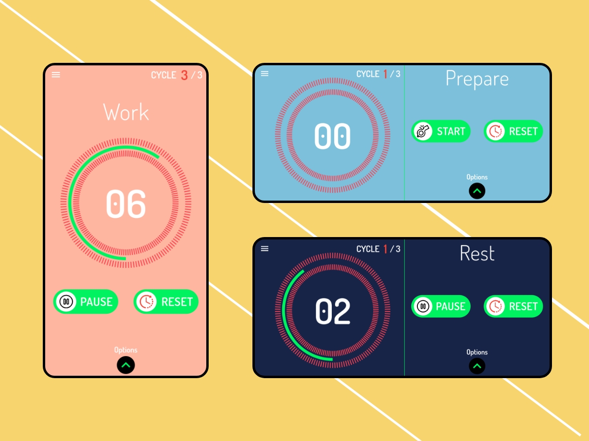

# Tabata timer

My very first flutter app.

## Description
Tabata timer is a free interval workout timer app for high-intensity interval training (HIIT timer). It is more than a stopwatch or countdown clock.
* install the app and try it https://play.google.com/store/apps/details?id=me.bouchfar.tabata

## How to run
* Clone this repo
* Run `flutter packages get`
* Run `flutter run` (remember open simulator or connect physical device, iOS auto run additional command `pod install`)

## Getting Started

This project is a starting point for a Flutter application.

A few resources to get you started if this is your first Flutter project:

- [Lab: Write your first Flutter app](https://flutter.dev/docs/get-started/codelab)
- [Cookbook: Useful Flutter samples](https://flutter.dev/docs/cookbook)

For help getting started with Flutter, view our
[online documentation](https://flutter.dev/docs), which offers tutorials,
samples, guidance on mobile development, and a full API reference.
